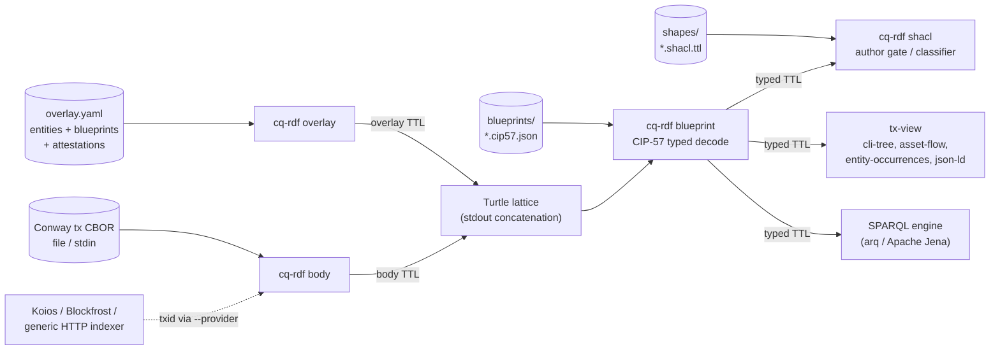

# cardano-ledger-rdf

Cardano transaction graph and RDF tools.

## What is this

`cardano-ledger-rdf` turns any Cardano transaction into a deterministic
RDF graph that two people can actually *use*:

- **Transaction authors** — before you sign or submit, check that a
  transaction conforms to your application's rules, and read the result
  in your application's own words ("contingency disburse: 4/4 owners ✓,
  destination off allowlist ✗") instead of a ledger error code. A
  non-conforming transaction never reaches a co-signer.
- **Auditors** — query and classify what already happened on-chain
  across a whole lattice of transactions, using the same application
  vocabulary and the same constraints. A transaction that conforms was
  built by the canonical pipeline; one that violates is foreign or
  off-spec — anomaly detection for free.

Both UXes run on the **same artefact** — the RDF graph of the
transaction — and the **same generic engine**. What makes them speak a
particular application's language is a small bundle of **RDF assets that
the application developer ships and parametrizes**:

| Asset | Slot | Parametrizes |
|---|---|---|
| **overlay** | `cq-rdf overlay` | the app's entities, labels, and attestations — operator/app reference data |
| **blueprints** | `cq-rdf blueprint` | typed datum/redeemer decode (CIP-57) so contract fields are queryable |
| **shapes** | `cq-rdf shacl` | SHACL conformance + hygiene constraints — the author gate and the auditor classifier |

Transaction metadata needs no asset slot: `cq-rdf body` decodes every
metadata label into faithful triples as part of the body graph.

The engine is **generic Cardano RDF**; the assets are the **app's
parametrization**. An application developer ships them the way they ship
a policy id; from then on any author or auditor gets the UX for free,
with no bespoke tooling. The [2026-05 Amaru treasury](docs/case-studies/2026-05-amaru-treasury/README.md)
case study is the worked canary — its `overlay.yaml`, `blueprints/`, and
`shapes/` are exactly this asset bundle.

## Architecture

The runtime is two executables. `cq-rdf` ships four orthogonal
subcommands that compose through shell pipes; `tx-view` projects the
resulting Turtle through packaged views. Everything is an offline
transformation over local files except `cq-rdf body --provider`, the
single network boundary.



| Tool | Role |
|------|------|
| `cq-rdf` | The runtime. Four composable subcommands — `overlay`, `body`, `blueprint`, `shacl` — each a pure function with a narrow IO contract. |
| `tx-view` | Project a generated Turtle graph through packaged views (`cli-tree`, `asset-flow`, `entity-occurrences`, `json-ld`). |
| `tx-graph` | Deprecated one-release compatibility symlink for the old transaction-body CLI shape. |

### Relationship to cardano-tx-tools

Generic transaction applications — diffing, inspecting, signing,
validating, load generation — belong in `cardano-tx-tools`, a downstream
consumer. The dependency graph between the two repositories is acyclic
by construction, and each direction crosses a deliberate boundary:

- **`cardano-tx-tools` → `cardano-ledger-rdf`, at the CLI boundary
  only.** `cardano-tx-tools` consumes this repository by piping over
  `cq-rdf body` output; it never links the `cardano-ledger-rdf`
  library. The RDF surface stays a process boundary, not a Haskell
  dependency.
- **`cardano-ledger-rdf` → `cardano-tx-tools:tx-build`, as a
  test-suite-only dependency.** The transaction builder has a single
  source of truth — the public `tx-build` sub-library in
  `cardano-tx-tools` — which this repository's fixture generators link
  to construct the sample transactions behind the golden graphs. The
  library and the `cq-rdf` / `tx-view` executables gain nothing from it:
  the emitter walks ledger-native types directly.

## Install

Prebuilt artifacts (release assets are versioned — check
[the latest release](https://github.com/lambdasistemi/cardano-ledger-rdf/releases/latest)
for the current version string):

```bash
# Linux x86_64 / aarch64 — AppImage (also .deb / .rpm / musl tarball)
v=0.4.0.0
base=https://github.com/lambdasistemi/cardano-ledger-rdf/releases/download/v$v
curl -L "$base/cq-rdf-$v-x86_64-linux.AppImage"  -o cq-rdf  && chmod +x cq-rdf
curl -L "$base/tx-view-$v-x86_64-linux.AppImage" -o tx-view && chmod +x tx-view

# macOS (Homebrew tap)
brew install lambdasistemi/tap/cq-rdf lambdasistemi/tap/tx-view

# Nix — run straight from the flake
nix run github:lambdasistemi/cardano-ledger-rdf#cq-rdf  -- --help
nix run github:lambdasistemi/cardano-ledger-rdf#tx-view -- --help
```

The Linux artifacts and the Nix packages bundle Apache Jena, so
`cq-rdf shacl` works out of the box. The Homebrew tarball ships only the
binary and its native dylibs: `cq-rdf overlay`, `cq-rdf body`, and
`cq-rdf blueprint` are pure Haskell and need nothing extra, but
`cq-rdf shacl` and the `arq` SPARQL examples need Apache Jena on `PATH`
(`brew install jena`).

## Quickstart

Render one mainnet transaction as a human-readable tree, fetching its
CBOR by txid from the free Koios tier (no token needed):

```bash
cq-rdf body --provider koios \
  10a5c1dafe7dd8d4ab680e35dc53b8b550da90bea55f2c758f36474064f2e598 \
| tx-view --graph - --view cli-tree
```

Swap `--view cli-tree` for `asset-flow`, `entity-occurrences`, or
`json-ld`, or drop the `tx-view` stage to keep the raw Turtle. The
[end-to-end demo](https://lambdasistemi.github.io/cardano-ledger-rdf/demo/)
builds on exactly this command.

## Usage

The author gate and the auditor classifier are the *same* four-stage
pipe, pointed at different inputs and read with different intent:

```bash
# emit the app's overlay, fetch one body per txid, type the datums,
# then validate against the app's shapes:
cq-rdf overlay --in overlay.yaml > overlay.ttl
xargs -P8 -n1 cq-rdf body --provider blockfrost --token "$BLOCKFROST_PROJECT_ID" \
  < selections.txt > bodies.ttl
cat overlay.ttl bodies.ttl \
  | cq-rdf blueprint --blueprints blueprints/ \
  > package.ttl
cq-rdf shacl --shapes shapes/ < package.ttl     # author gate: exits non-zero on violations
arq --data package.ttl --query my.rq            # auditor: query the lattice via Apache Jena or any SPARQL engine
```

- **Author (pre-sign):** point `cq-rdf body` at the transaction you just
  built; `cq-rdf shacl --shapes` is a gate — it exits non-zero with a
  readable, domain-level violation, so you fix it before circulating.
- **Auditor (post-hoc):** point `cq-rdf body` at a lattice of on-chain
  txids; the *same* shapes become a classifier, and the app's SPARQL
  queries answer cross-transaction questions.

`cq-rdf body --provider` is the only network boundary in the core
pipeline: it fetches CBOR by txid from a koios / blockfrost /
generic-HTTP indexer (blockfrost requires `--token`). With
`--provider file` (the default) every stage is an offline
transformation over local files.

`tx-graph --rules X` is deprecated for one release. Use
`cq-rdf overlay --in X` for the operator overlay and concatenate that
with one or more `cq-rdf body ...` outputs. See
[docs/tx-graph.md](docs/tx-graph.md) for the migration table.

### Vocabulary

Two namespaces, each with a published ontology — the generic core and an
example explicit extension:

| Prefix | Layer |
|---|---|
| `cardano:` | Ledger primitives (`Transaction`, `Output`, `Datum`, metadata, …). The generic core. |
| `treasury:` | An accountability overlay (`OffChainEntity`, `paidVia`, `attests`, …). An explicit, app-shaped extension. |

The split is a principle, not an accident: the core models Cardano, never
a single application's business semantics; an app's meaning lives in its
assets and its own extension namespace. See [docs/vocab.md](docs/vocab.md).

### Library

| Module family | Role |
|---------------|------|
| `Cardano.Tx.Graph.*` | RDF graph emission, operator entity overlays, canonical Turtle/JSON-LD serialization. |
| `Cardano.Tx.View.*` | Packaged graph projections used by `tx-view` and future HTTP services. |
| `Cardano.Tx.Blueprint` | CIP-57 blueprint parsing for typed datum/redeemer predicates. |
| `Cardano.Tx.Decode` / `Cardano.Tx.Graph.Resolve` | Shared transaction decoding and resolved-input lookup for RDF tools. |

## Documentation

The full manual — demo, tool references, vocabulary, case studies — is
published at
[lambdasistemi.github.io/cardano-ledger-rdf](https://lambdasistemi.github.io/cardano-ledger-rdf/).
Specs and per-feature design notes live under `specs/`.

For AI agents, start at [AGENTS.md](AGENTS.md).

## Development

```bash
nix develop --quiet -c just build
nix develop --quiet -c just ci
nix flake check --no-eval-cache
```

Release automation packages only the RDF tools:

```bash
nix build .#cq-rdf-linux-release-artifacts
nix build .#tx-graph-linux-release-artifacts
nix build .#tx-view-linux-release-artifacts
```

Darwin/Homebrew artifacts are built by the corresponding GitHub Actions
workflows for the same executables.

## License

[Apache 2.0](LICENSE).
