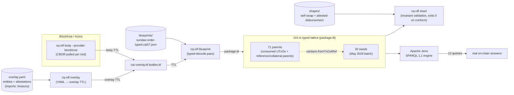

# Amaru Treasury May 2026

This case study runs twelve SPARQL queries over a real Amaru Treasury
May 2026 on-chain lattice built end-to-end from the `cq-rdf` runtime
pipe (`overlay` + `body` + `blueprint`), the closure fetched by
transaction CBOR, and Apache Jena, and validates two invariants on
that lattice via SHACL shapes.

The dataset is the 101-transaction lattice rooted in the May 2026
operator batch: 30 seed transactions and 71 closure parents. The seed
batch contains 3 disbursements, 5 reorganize transactions, 20 swap-order
transactions, 1 swap cancel, and 1 scoop dive. The closure was assembled
at depth 1 by fetching transaction CBOR for each consumed parent UTxO so
cross-transaction joins have both sides of each input reference in the
same graph.

## Dataset and queries

Dataset assembly is documented in [Dataset selection](selection.md), with
the full transaction list in [`selections.txt`](selections.txt), the
case-local operator overlay in [`overlay.yaml`](overlay.yaml), and the
reproduce pipe in [`README.md`](README.md). The SPARQL evidence is split into
one page per query: [Q0 conservation](queries/q0-conservation-check.md),
[Q1 monthly totals](queries/q1-monthly-totals.md), [Q2 USDM landing](queries/q2-where-did-usdm-land.md),
[Q3 ADA scope flow](queries/q3-per-scope-ada-flow.md), [Q4 multisig shape](queries/q4-multisig-shape-distribution.md),
[Q5 vendor chain](queries/q5-vendor-payment-chain.md), [Q6 disbursement detection](queries/q6-disbursement-detection.md),
[Q7 USDM scope flow](queries/q7-per-scope-usdm-flow.md), [Q8 scoop detection](queries/q8-scoop-detection.md),
[Q9 reference-script reuse](queries/q9-reference-script-reuse.md), [Q10 scoop-recipient resolution](queries/q10-scoop-recipient-resolution.md),
and [Q11 self-swap validation](queries/q11-self-swap-validation.md).

## Invariants

The operator ships SHACL shapes that turn the human-readable
invariants into machine-checked gates. `cq-rdf shacl --shapes
shapes/` runs every shape against the typed lattice and exits
non-zero on any violation. Two shapes ship today; the directory
is meant to grow as new invariants are added.

| Shape | Invariant |
|---|---|
| [`shapes/self-swap.shacl.ttl`](shapes/self-swap.shacl.ttl) | Every operator-issued Sundae OrderDatum routes back to `network_compliance`. Machine form of [Q11](queries/q11-self-swap-validation.md). |
| [`shapes/attested-disbursement.shacl.ttl`](shapes/attested-disbursement.shacl.ttl) | Every `treasury:OffChainEntity` with `treasury:paidVia` has at least one `treasury:Attestation` linked. |

See [`shapes/README.md`](shapes/README.md) for the reproduce pipe.

## Data flow



## Findings

The conservation query balances exactly: seed inputs equal seed
outputs plus fees, with a zero-lovelace gap. The 30 seed transactions
paid **19.931398 ADA** in total fees. The most expensive single
transaction in the batch is the reorganize `71ff129b…` at
**1.572508 ADA** — an 11-input reorganize at the network_compliance
scope. The contingency disburse `18d57a4f…` is **not** the most
expensive seed; it pays **0.415814 ADA** in fee (2 inputs). The
per-tx fee in this batch tracks input count and script execution
units, not multisig shape.

The May flow moves 205,000 ADA from contingency to network_compliance,
then spends network_compliance ADA into SundaeSwap order flow and receives
USDM back through scoops. The vendor bridge sends 418,750 USDM to
`amaru.cag-payee`, linked in the overlay to Antithesis and Castellum IPFS
attestations.

The lattice exposes two swap-order consumption events in the selected
batch: the 9-order scoop dive `4e2642080c8d171aad05baed11b076de498b76acecc1c2412660048fae8aefa3`
and the one-order swap cancel `a8bab7bfe1e2ed9d3a5b40189c8de51c5974a6e05c71fc1000a6abd57500b365`.
Reference-script reuse is concentrated in four hot parent UTxOs, matching
the expected reference-input pattern for the treasury and swap scripts.

## How to reproduce

The reproduce pipe is documented in [`README.md`](README.md). In
summary, from this directory:

```bash
cq-rdf overlay --in overlay.yaml > overlay.ttl
xargs -P8 -n1 cq-rdf body --provider blockfrost < selections.txt > bodies.ttl
cat overlay.ttl bodies.ttl \
  | cq-rdf blueprint --blueprints blueprints/ \
  > package.ttl
cq-rdf shacl --shapes shapes/ < package.ttl

# Then save any query page's SPARQL block as qN.rq and run it:
arq --data package.ttl --query q0-conservation-check.rq
```

Substitute `--provider koios` (or any other supported provider) if
Blockfrost is not on hand. `cq-rdf shacl --shapes shapes/` reads
`package.ttl` on stdin and exits non-zero on a violation, so a clean
exit is also a clean invariant check.

## Limitations to be solved on our side

Each of these is a real gap in the present-day pipeline that
limits SPARQL expressiveness; each has a known fix path.

### 1. Body emitter did not emit `cardano:hasIndex` on outputs

**Impact**: a tx output's index in its parent tx is needed for
the closure JOIN (`?orderOut cardano:hasIndex ?ix`) but the
prior body emitter encoded the index only in the bnode label
(`_:output1`, `_:output2`, …). Blank-node labels are not
semantic in RDF.

**Resolved** (#100, in `Cardano.Tx.Graph.Emit.Project.emitOutput`):
the body emitter now emits `cardano:hasIndex` (zero-based) on every
output as part of the canonical Turtle. The `scripts/tx-lattice`
post-processing block has been removed.

### 2. Body emitter did not emit the tx's own hash

**Resolved** (#100, in `Cardano.Tx.Graph.Emit.Project.emitTxBlock`):
the body emitter now hashes the Conway tx body via
`Cardano.Ledger.Hashes.hashAnnotated` and pins it as
`<urn:cardano:tx:<HEX>> cardano:hasTxId <urn:cardano:id:TxId:<HEX>>` —
using the same `Identifier`-typed IRI pattern as inputs' parent-txid
references, so SPARQL JOINs across the closure use
`cardano:hasTxId/cardano:bytesHex` uniformly.

### 3. CIP-57 blueprint binding rejects two scripts sharing a blueprint

**Resolved** (#101, in `Cardano.Tx.Graph.Rules.Load.Resolve.Imports.dedupBlueprints`):
the loader now distinguishes two cases when a predicate URI is
declared twice. If both registrations point at the same parsed
`Blueprint` value, both script-hash bindings are accepted — this
is the operator-intended "shared parameterised contract" pattern
(Amaru contingency vs network_compliance both spending the
`treasury.treasury.spend` contract). A true cross-blueprint
predicate-URI collision still fails fast with
`DuplicateBlueprintPredicate`. The presentation's
`blueprints/` directory can now register the treasury blueprint
against both treasury scopes and surface the typed redeemer
decode on either side once gap #4 lands.

### 4. Typed redeemer decode not firing on live mainnet

**Resolved** (#112 — landed in the same PR as #103). The root
cause was that
`Cardano.Tx.Graph.Emit.Witness.resolveRedeemerPurposeHash` for
`ConwaySpending` derives the spending script hash by reading the
consumed input's `TxOut` from a `ResolvedUTxO` map. The earlier
lattice path never populated that map, so dispatch silently fell back
to `NoBlueprintRegistered`.

The current path composes one graph per CBOR via the `cq-rdf`
subcommand pipe:

* `cq-rdf body` emits a single transaction graph with tx-scoped
  positional blank nodes and stable content-addressed identifiers.
* The operator pipe (`cq-rdf overlay` + `xargs … cq-rdf body` +
  `cat`) writes the operator overlay once and appends one body graph
  per transaction. Cross-transaction queries join through the
  emitted `TxId`, `TxOutRef`, address, asset, and credential
  identifiers rather than through a special merge command — for the
  seed batch and BFS-walked ancestors alike.

(The original #112 fix was an on-disk `--closure-dir DIR`
resolver that read parent CBORs from disk at emit time. #114
reduced that disk handshake into the pure-transformation
contract: the body emitter now sees the whole lattice as its
input, not as a side-channel directory.)

Verified on a 7-tx closure of contingency disburse
`18d57a4f…`: the seed's redeemerData bnodes now carry
`:TreasurySpendRedeemer_amount _:redeemerData1_amount` triples,
materialising the Reorganize / SweepTreasury / Fund / Disburse
constructor distinction the SPARQL queries can JOIN on.

### 5. Sundae V3 order — typed datum still opaque

**Resolved** (#103 — and reclassified). The script at hash
`fa6a58bb…` is **SundaeSwap V3**'s `order.spend` validator, not
an Amaru contract (authoritatively named
`sundaeOrderScriptHashMainnet` in
`/code/amaru-treasury-tx/lib/Amaru/Treasury/Constants.hs`). The
upstream Aiken plutus.json now ships under
`test/fixtures/tx-graph/blueprints/sundaeswap-v3/` pinned
at commit `be33466b…` of
`github.com/SundaeSwap-finance/sundae-contracts` (Apache-2.0).

What lands:

- **Typed redeemer decode** — Sundae V3's `OrderRedeemer` is
  `Scoop | Cancel`. Once registered against an entity named
  `sundae.swap.v3.order`, every redeemer that spends a Sundae
  order UTxO emits a `:OrderRedeemer_Scoop` or
  `:OrderRedeemer_Cancel` predicate. New SPARQL queries:
  "count scoops vs cancels in the month", "list every cancelled
  order".

What still doesn't land:

- **Typed datum decode** — Sundae's CIP-57 blueprint types the
  swap-order datum as `Data` (intentional, by their design).
  The 6-field on-chain shape stays opaque. Q10 keeps the
  scoop-join workaround for resolving the human recipient.

  *Update for #66 Phase 4*: when the operator points `cq-rdf
  blueprint` at the upstream Sundae plutus.json, the
  `documentation.spend` validator's typed `OrderDatum` schema (with
  the `MultisigScript` recursive subtree degraded to opaque
  `Data`) decodes the datum's named fields — including
  `destination.address.payment_credential`. The
  [`shapes/self-swap.shacl.ttl`](shapes/self-swap.shacl.ttl) shape
  uses that typed path to enforce the self-swap invariant on every
  operator-issued order. See
  [Q11](queries/q11-self-swap-validation.md) for the explanatory
  SPARQL.

`overlay.yaml` in this case-study folder names the entity
`sundae.swap.v3.order` (the authoritative name) — the older
`amaru.swap.v2` label has been retired throughout the
presentation. Q3's narrative "sundae.swap.v3.order + pools +
scoopers" row, Q8's prose, and Q10's mermaid all refer to this
same Sundae V3 order script.

### 6. `tx-lattice` is a shell prototype

**Resolved** (epic #66, Phase 5): the case study no longer ships an
orchestrator shell script. The runtime is reached through four
narrow pure subcommands — `cq-rdf overlay`, `cq-rdf body`,
`cq-rdf blueprint`, `cq-rdf shacl` — composed by a documented Unix
pipe in [`README.md`](README.md). Parallel CBOR fetch is delegated
to `xargs -P8`, an operator-tunable knob rather than a hard-coded
loop. The "closure walk" pre-filter remains an operator concern;
operators stream txids in from any source (hand-edited file,
`gh api`, future `cq-select` service) without the runtime needing
to know.

### 7. `cq-rdf overlay` rejects overlay files carrying off-chain entities

**Resolved** (#105, across `Cardano.Tx.Graph.Rules.Load.{Types,
Parse.Yaml, Emit.Overlay}`): a single overlay file can now carry
on-chain entities, off-chain overlay vendors, and IPFS-anchored
attestations side by side. Concretely:

- An entity in the `entities:` list with no on-chain identifier
  shape (no `from-address` / `script` / `asset` / `pool` / `drep`
  / `keys+bytes`) but **with** `paid-via:` is accepted as an
  off-chain overlay node and emitted as `:slug a
  treasury:OffChainEntity`.
- A new top-level `attestations:` block declares
  IPFS-anchored artefacts; each entry emits a
  `[] a treasury:Attestation ; rdfs:label "..." ;
  treasury:attests :slug ; treasury:ipfs <ipfs://...>` block in the overlay.
- New optional `role:` and `paid-via:` keys are accepted on any
  entity (on-chain or off-chain); they emit `treasury:role` and
  `treasury:paidVia` triples respectively.

The May 2026 presentation can now drop the `overlay.ttl` companion
file and ship a single `overlay.yaml`; Q5 (vendor-payment chain)
runs unchanged against the merged document.

### 8. Scope mapping is hard-coded inside each SPARQL query

**Resolved** (#100, in `Cardano.Tx.Graph.Rules.Load.Emit.Overlay`):
every entity declared via `from-address:` now emits a top-level
`:slug cardano:bech32 "<addr>"` triple. The per-scope queries
(Q3, Q5, Q7) can be rewritten to JOIN on
`?entity rdfs:label ?scope . ?entity cardano:bech32 ?bech` instead
of carrying hard-coded bech32 literals in `VALUES` blocks — a
follow-up to this issue will land that refactor.

### 9. Overlay blank-node inflation under per-tx `--rules`

**Resolved** (epic #66, Phases 2 and 5): the legacy `tx-graph
--rules` mode re-emitted the overlay (including blank-node
sub-structure for off-chain attestations and vendor metadata) once
per body call. Entity IRIs deduplicated as triples, but blank
nodes did not — Q5 and Q11 had to add `SELECT DISTINCT` to
compensate. The new pipe emits the overlay exactly once
(`cq-rdf overlay --in overlay.yaml > overlay.ttl`) and concatenates
it with one body graph per transaction (`cq-rdf body`). No
overlay blank node ever appears twice in the lattice, and the
`SELECT DISTINCT` workarounds in Q5 / Q11 are no longer load-bearing.
