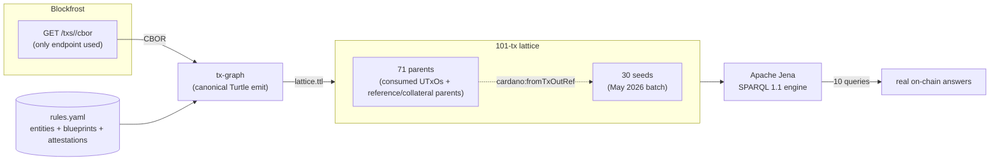

# Amaru Treasury May 2026

This case study runs ten SPARQL queries over a real Amaru Treasury
May 2026 on-chain lattice built end-to-end from `tx-graph`, the
closure fetched by transaction CBOR, and Apache Jena.

The dataset is the 101-transaction lattice rooted in the May 2026
operator batch: 30 seed transactions and 71 closure parents. The seed
batch contains 3 disbursements, 5 reorganize transactions, 20 swap-order
transactions, 1 swap cancel, and 1 scoop dive. The closure was assembled
at depth 1 by fetching transaction CBOR for each consumed parent UTxO so
cross-transaction joins have both sides of each input reference in the
same graph.

## Dataset and queries

Dataset assembly is documented in [Dataset selection](selection.md), with
the full transaction list in [`selections.txt`](selections.txt), the
case-local operator overlay in [`rules.yaml`](rules.yaml), and the runnable
workflow in [`pipeline.sh`](pipeline.sh). The SPARQL evidence is split into
one page per query: [Q0 conservation](queries/q0-conservation-check.md),
[Q1 monthly totals](queries/q1-monthly-totals.md), [Q2 USDM landing](queries/q2-where-did-usdm-land.md),
[Q3 ADA scope flow](queries/q3-per-scope-ada-flow.md), [Q4 multisig shape](queries/q4-multisig-shape-distribution.md),
[Q5 vendor chain](queries/q5-vendor-payment-chain.md), [Q6 disbursement detection](queries/q6-disbursement-detection.md),
[Q7 USDM scope flow](queries/q7-per-scope-usdm-flow.md), [Q8 scoop detection](queries/q8-scoop-detection.md),
[Q9 reference-script reuse](queries/q9-reference-script-reuse.md), and [Q10 scoop-recipient resolution](queries/q10-scoop-recipient-resolution.md).

## Data flow



## Findings

The conservation query balances exactly: seed inputs equal seed outputs
plus fees, with a zero ADA gap. The 30 seed transactions paid 19.93 ADA
in total fees; the contingency disbursement is the highest-fee single
transaction because it carries the 4-of-4 multisig shape.

The May flow moves 205,000 ADA from contingency to network_compliance,
then spends network_compliance ADA into SundaeSwap order flow and receives
USDM back through scoops. The vendor bridge sends 418,750 USDM to
`amaru.cag-payee`, linked in the overlay to Antithesis and Castellum IPFS
attestations.

The lattice exposes two swap-order consumption events in the selected
batch: the 9-order scoop dive `4e2642080c8d171aad05baed11b076de498b76acecc1c2412660048fae8aefa3`
and the one-order swap cancel `a8bab7bfe1e2ed9d3a5b40189c8de51c5974a6e05c71fc1000a6abd57500b365`.
Reference-script reuse is concentrated in four hot parent UTxOs, matching
the expected reference-input pattern for the treasury and swap scripts.

## How to reproduce

```sh
# 1. Assemble cbor/ from selections.txt; see Dataset selection.
# 2. Emit one SPARQL-queryable lattice:
tx-graph --rules rules.yaml --in-dir cbor/ --out lattice.ttl

# 3. Save any query page's SPARQL block as qN.rq, then run it:
arq --data lattice.ttl --query q0-conservation-check.rq
```

`pipeline.sh` automates the CBOR download and lattice emission path.

## Limitations to be solved on our side

Each of these is a real gap in the present-day pipeline that
limits SPARQL expressiveness; each has a known fix path.

### 1. `tx-graph` does not emit `cardano:hasIndex` on outputs

**Impact**: a tx output's index in its parent tx is needed for
the closure JOIN (`?orderOut cardano:hasIndex ?ix`) but tx-graph
encodes the index only in the bnode label (`_:output1`,
`_:output2`, …). Blank-node labels are not semantic in RDF.

**Resolved** (#100, in `Cardano.Tx.Graph.Emit.Project.emitOutput`):
the body emitter now emits `cardano:hasIndex` (zero-based) on every
output as part of the canonical Turtle. The `scripts/tx-lattice`
post-processing block has been removed.

### 2. `tx-graph` does not emit the tx's own hash

**Resolved** (#100, in `Cardano.Tx.Graph.Emit.Project.emitTxBlock`):
the body emitter now hashes the Conway tx body via
`Cardano.Ledger.Hashes.hashAnnotated` and pins it as
`_:tx cardano:hasTxId _:hash_txid_<HEX>` — using the same
`Identifier`-typed bnode pattern as inputs' parent-txid references,
so SPARQL JOINs across the closure use
`cardano:hasTxId/cardano:bytesHex` uniformly.

### 3. CIP-57 blueprint binding rejects two scripts sharing a blueprint

**Resolved** (#101, in `Cardano.Tx.Graph.Rules.Load.Resolve.Imports.dedupBlueprints`):
the loader now distinguishes two cases when a predicate URI is
declared twice. If both registrations point at the same parsed
`Blueprint` value, both script-hash bindings are accepted — this
is the operator-intended "shared parameterised contract" pattern
(Amaru contingency vs network_compliance both spending the
`treasury.treasury.spend` contract). A true cross-blueprint
predicate-URI collision still fails fast with
`DuplicateBlueprintPredicate`. The presentation's `rules.yaml`
can now register `amaru-treasury.cip57.json` against both
treasury scopes and surface the typed redeemer decode on either
side once gap #4 lands.

### 4. Typed redeemer decode not firing on live mainnet

**Resolved** (#112 — landed in the same PR as #103). The root
cause was that
`Cardano.Tx.Graph.Emit.Witness.resolveRedeemerPurposeHash` for
`ConwaySpending` derives the spending script hash by reading the
consumed input's `TxOut` from a `ResolvedUTxO` map. The earlier
lattice path never populated that map, so dispatch silently fell back
to `NoBlueprintRegistered`.

The fix introduced **a lattice-aware in-memory resolver**:

* `tx-graph --in-dir DIR` indexes every CBOR in DIR by its
  computed `TxId` (`hashAnnotated . bodyTxL`) and resolves each
  emitted tx's spending / reference / collateral inputs against
  the in-memory map — pulling the parent body's output at the
  consumed `TxIx`. The resolver is implemented in
  `app/tx-graph/Main.hs:inMemoryResolver` and plugs into the
  existing `Cardano.Tx.Graph.Resolve` chain abstraction — no
  changes to the Witness walker were needed.
* `scripts/tx-lattice` walks the BFS closure into
  `OUT_DIR/cbor/<txid>.cbor` (Blockfrost `/txs/<hash>/cbor` per
  parent), then hands the whole directory to a single
  `tx-graph --in-dir OUT_DIR/cbor --out-dir OUT_DIR` invocation.
  Every tx in the closure resolves its inputs against the same
  in-memory lattice, so spending redeemers dispatch typed-decode
  via the consumed parent's script hash uniformly across seeds
  and BFS-walked ancestors alike.

(The original #112 fix was an on-disk `--closure-dir DIR`
resolver that read parent CBORs from disk at emit time. #114
reduced that disk handshake into the pure-transformation
contract: tx-graph now sees the whole lattice as its input,
not as a side-channel directory.)

Verified on a 7-tx closure of contingency disburse
`18d57a4f…`: the seed's redeemerData bnodes now carry
`:TreasurySpendRedeemer_amount _:redeemerData1_amount` triples,
materialising the Reorganize / SweepTreasury / Fund / Disburse
constructor distinction the SPARQL queries can JOIN on.

### 5. Stale swap-v2 blueprint

**Resolved** (#103 — and reclassified). The script at hash
`fa6a58bb…` is **SundaeSwap V3**'s `order.spend` validator, not
an Amaru contract (authoritatively named
`sundaeOrderScriptHashMainnet` in
`/code/amaru-treasury-tx/lib/Amaru/Treasury/Constants.hs`). The
upstream Aiken plutus.json now ships under
`test/fixtures/tx-graph/blueprints/sundaeswap-v3/` pinned
at commit `be33466b…` of
`github.com/SundaeSwap-finance/sundae-contracts` (Apache-2.0).

What lands:

- **Typed redeemer decode** — Sundae V3's `OrderRedeemer` is
  `Scoop | Cancel`. Once registered against an entity named
  `sundae.swap.v3.order`, every redeemer that spends a Sundae
  order UTxO emits a `:OrderRedeemer_Scoop` or
  `:OrderRedeemer_Cancel` predicate. New SPARQL queries:
  "count scoops vs cancels in the month", "list every cancelled
  order".

What still doesn't land:

- **Typed datum decode** — Sundae's CIP-57 blueprint types the
  swap-order datum as `Data` (intentional, by their design).
  The 6-field on-chain shape stays opaque. Q10 keeps the
  scoop-join workaround for resolving the human recipient.

Earlier presentation entries that named the script
`amaru.swap.v2` (e.g. Q8/Q10 mermaid + comments) are referring
to this same Sundae V3 order script — the correct entity name
in `rules.yaml` is `sundae.swap.v3.order`.

### 6. `tx-lattice` is a shell prototype

**Impact**: closure walk, Blockfrost CBOR fetch, and txid/index
post-processing are all bash + jq. Brittle, hard to test, single-
threaded. The pre-filter for off-chain entities (when rules.yaml
mixes on-chain + off-chain) is a separate concern that doesn't
exist yet.

**Fix**: re-implement as a Haskell executable (proposed
`tx-lattice` companion to `tx-graph`). Same on-disk contract
(a directory of canonical Turtle files keyed by txid); typed code
path; parallel CBOR fetch.

### 7. `tx-graph --rules` rejects rules.yaml files carrying off-chain entities

**Resolved** (#105, across `Cardano.Tx.Graph.Rules.Load.{Types,
Parse.Yaml, Emit.Overlay}`): a single `rules.yaml` can now carry
on-chain entities, off-chain overlay vendors, and IPFS-anchored
attestations side by side. Concretely:

- An entity in the `entities:` list with no on-chain identifier
  shape (no `from-address` / `script` / `asset` / `pool` / `drep`
  / `keys+bytes`) but **with** `paid-via:` is accepted as an
  off-chain overlay node and emitted as `:slug a
  cardano:OffChainEntity`.
- A new top-level `attestations:` block declares
  IPFS-anchored artefacts; each entry emits a
  `[] a cardano:Attestation ; rdfs:label "..." ; cardano:attests
  :slug ; cardano:ipfs <ipfs://...>` block in the overlay.
- New optional `role:` and `paid-via:` keys are accepted on any
  entity (on-chain or off-chain); they emit `cardano:role` and
  `cardano:paidVia` triples respectively.

The May 2026 presentation can now drop the `overlay.ttl` companion
file and ship a single rules.yaml; Q5 (vendor-payment chain) runs
unchanged against the merged document.

### 8. Scope mapping is hard-coded inside each SPARQL query

**Resolved** (#100, in `Cardano.Tx.Graph.Rules.Load.Emit.Overlay`):
every entity declared via `from-address:` now emits a top-level
`:slug cardano:bech32 "<addr>"` triple. The per-scope queries
(Q3, Q5, Q7) can be rewritten to JOIN on
`?entity rdfs:label ?scope . ?entity cardano:bech32 ?bech` instead
of carrying hard-coded bech32 literals in `VALUES` blocks — a
follow-up to this issue will land that refactor.
