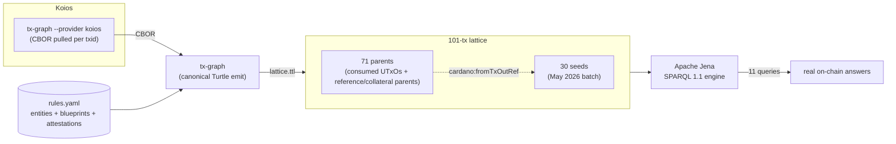

# Amaru Treasury May 2026

This case study runs eleven SPARQL queries over a real Amaru Treasury
May 2026 on-chain lattice built end-to-end from `tx-graph`, the
closure fetched by transaction CBOR, and Apache Jena.

The dataset is the 101-transaction lattice rooted in the May 2026
operator batch: 30 seed transactions and 71 closure parents. The seed
batch contains 3 disbursements, 5 reorganize transactions, 20 swap-order
transactions, 1 swap cancel, and 1 scoop dive. The closure was assembled
at depth 1 by fetching transaction CBOR for each consumed parent UTxO so
cross-transaction joins have both sides of each input reference in the
same graph.

## Dataset and queries

Dataset assembly is documented in [Dataset selection](selection.md), with
the full transaction list in [`selections.txt`](selections.txt), the
case-local operator overlay in [`rules.yaml`](rules.yaml), and the runnable
workflow in [`pipeline.sh`](pipeline.sh). The SPARQL evidence is split into
one page per query: [Q0 conservation](queries/q0-conservation-check.md),
[Q1 monthly totals](queries/q1-monthly-totals.md), [Q2 USDM landing](queries/q2-where-did-usdm-land.md),
[Q3 ADA scope flow](queries/q3-per-scope-ada-flow.md), [Q4 multisig shape](queries/q4-multisig-shape-distribution.md),
[Q5 vendor chain](queries/q5-vendor-payment-chain.md), [Q6 disbursement detection](queries/q6-disbursement-detection.md),
[Q7 USDM scope flow](queries/q7-per-scope-usdm-flow.md), [Q8 scoop detection](queries/q8-scoop-detection.md),
[Q9 reference-script reuse](queries/q9-reference-script-reuse.md), [Q10 scoop-recipient resolution](queries/q10-scoop-recipient-resolution.md), and [Q11 self-swap validation](queries/q11-self-swap-validation.md).

## Data flow



## Findings

The conservation query balances exactly: seed inputs equal seed
outputs plus fees, with a zero-lovelace gap. The 30 seed transactions
paid **19.931398 ADA** in total fees. The most expensive single
transaction in the batch is the reorganize `71ff129b…` at
**1.572508 ADA** — an 11-input reorganize at the network_compliance
scope. The contingency disburse `18d57a4f…` is **not** the most
expensive seed; it pays **0.415814 ADA** in fee (2 inputs). The
per-tx fee in this batch tracks input count and script execution
units, not multisig shape.

The May flow moves 205,000 ADA from contingency to network_compliance,
then spends network_compliance ADA into SundaeSwap order flow and receives
USDM back through scoops. The vendor bridge sends 418,750 USDM to
`amaru.cag-payee`, linked in the overlay to Antithesis and Castellum IPFS
attestations.

The lattice exposes two swap-order consumption events in the selected
batch: the 9-order scoop dive `4e2642080c8d171aad05baed11b076de498b76acecc1c2412660048fae8aefa3`
and the one-order swap cancel `a8bab7bfe1e2ed9d3a5b40189c8de51c5974a6e05c71fc1000a6abd57500b365`.
Reference-script reuse is concentrated in four hot parent UTxOs, matching
the expected reference-input pattern for the treasury and swap scripts.

A case-study override at
[`blueprints/sundae-order-typed.cip57.json`](blueprints/sundae-order-typed.cip57.json)
re-types Sundae V3's `order.spend` datum from the upstream `Data`
shape to the fully-typed `OrderDatum` (`pool_ident`, `owner` (kept
opaque to dodge the `MultisigScript` definition cycle),
`max_protocol_fee`, `destination`, `details`, `extension`). On the
typed decode, Q11 reads `OrderDatum.destination.address.payment_credential`
straight off every swap order placed by a seed transaction and
confirms each one returns to
`amaru-treasury.network_compliance`'s script hash
`32201dc1e827…` — every order, no leaks. This is the validation the
operator needs **before** signing a swap-order placement: the
post-swap USDM is contractually required to land back on the
treasury.

## How to reproduce

```sh
# 1. Build the lattice. pipeline.sh fetches each txid's CBOR through
#    Koios (`tx-graph --provider koios`) and concatenates the
#    rules.yaml overlay + one body graph per transaction into a single
#    SPARQL-queryable Turtle file at <out>/lattice.ttl. KOIOS_TOKEN is
#    optional; without it Koios rate-limits anonymously.
[KOIOS_TOKEN=...] ./pipeline.sh ./out

# 2. Save any query page's SPARQL block as qN.rq, then run it:
arq --data ./out/lattice.ttl --query q0-conservation-check.rq
```

## Limitations to be solved on our side

Each of these is a real gap in the present-day pipeline that
limits SPARQL expressiveness; each has a known fix path.

### 1. `tx-graph` does not emit `cardano:hasIndex` on outputs

**Impact**: a tx output's index in its parent tx is needed for
the closure JOIN (`?orderOut cardano:hasIndex ?ix`) but tx-graph
encodes the index only in the bnode label (`_:output1`,
`_:output2`, …). Blank-node labels are not semantic in RDF.

**Resolved** (#100, in `Cardano.Tx.Graph.Emit.Project.emitOutput`):
the body emitter now emits `cardano:hasIndex` (zero-based) on every
output as part of the canonical Turtle. The `scripts/tx-lattice`
post-processing block has been removed.

### 2. `tx-graph` does not emit the tx's own hash

**Resolved** (#100, in `Cardano.Tx.Graph.Emit.Project.emitTxBlock`):
the body emitter now hashes the Conway tx body via
`Cardano.Ledger.Hashes.hashAnnotated` and pins it as
`<urn:cardano:tx:<HEX>> cardano:hasTxId <urn:cardano:id:TxId:<HEX>>` —
using the same `Identifier`-typed IRI pattern as inputs' parent-txid
references, so SPARQL JOINs across the closure use
`cardano:hasTxId/cardano:bytesHex` uniformly.

### 3. CIP-57 blueprint binding rejects two scripts sharing a blueprint

**Resolved** (#101, in `Cardano.Tx.Graph.Rules.Load.Resolve.Imports.dedupBlueprints`):
the loader now distinguishes two cases when a predicate URI is
declared twice. If both registrations point at the same parsed
`Blueprint` value, both script-hash bindings are accepted — this
is the operator-intended "shared parameterised contract" pattern
(Amaru contingency vs network_compliance both spending the
`treasury.treasury.spend` contract). A true cross-blueprint
predicate-URI collision still fails fast with
`DuplicateBlueprintPredicate`. The presentation's `rules.yaml`
can now register `amaru-treasury.cip57.json` against both
treasury scopes and surface the typed redeemer decode on either
side once gap #4 lands.

### 4. Typed redeemer decode not firing on live mainnet

**Resolved** (#112 — landed in the same PR as #103). The root
cause was that
`Cardano.Tx.Graph.Emit.Witness.resolveRedeemerPurposeHash` for
`ConwaySpending` derives the spending script hash by reading the
consumed input's `TxOut` from a `ResolvedUTxO` map. The earlier
lattice path never populated that map, so dispatch silently fell back
to `NoBlueprintRegistered`.

The current path composes one graph per CBOR:

* `tx-graph` emits a single transaction graph with tx-scoped
  positional blank nodes and stable content-addressed identifiers.
* `pipeline.sh` writes the operator overlay once, then loops over
  `OUT_DIR/cbor/*.cbor` and appends each `tx-graph "$f"` body graph.
  Cross-transaction queries join through the emitted `TxId`,
  `TxOutRef`, address, asset, and credential identifiers rather than
  through a special merge command.
  and BFS-walked ancestors alike.

(The original #112 fix was an on-disk `--closure-dir DIR`
resolver that read parent CBORs from disk at emit time. #114
reduced that disk handshake into the pure-transformation
contract: tx-graph now sees the whole lattice as its input,
not as a side-channel directory.)

Verified on a 7-tx closure of contingency disburse
`18d57a4f…`: the seed's redeemerData bnodes now carry
`:TreasurySpendRedeemer_amount _:redeemerData1_amount` triples,
materialising the Reorganize / SweepTreasury / Fund / Disburse
constructor distinction the SPARQL queries can JOIN on.

### 5. Sundae V3 order datum — typed via operator override

**Resolved**. Sundae's upstream Aiken `plutus.json` declares the
`order.spend` validator's datum as `{"$ref": "#/definitions/Data"}` —
even though the file *does* carry a fully-typed
`types/order/OrderDatum` definition (6 positional fields:
`pool_ident`, `owner`, `max_protocol_fee`, `destination`, `details`,
`extension`). The case study ships a one-ref override at
[`blueprints/sundae-order-typed.cip57.json`](blueprints/sundae-order-typed.cip57.json)
that re-points the validator's datum schema at the typed definition,
and `rules.yaml` registers it against the
`sundae.swap.v3.order` entity. Decode now produces typed
`:OrderDatum_pool_ident` / `:OrderDatum_max_protocol_fee` /
`:OrderDatum_destination` / `:OrderDatum_details` predicates on every
swap-order output.

**Carve-out**: Sundae's `MultisigScript` is a self-referential type
(`AllOf` / `AnyOf` constructors that contain `List<MultisigScript>`),
and the CIP-57 blueprint resolver in this repo rejects definition
cycles with `BlueprintDefinitionCycle`. The override therefore
re-types `OrderDatum.owner` to `Data` (one constructor arg) so the
field is emitted as an opaque sub-datum rather than crashing the
whole decode. The other five fields type fully.

Independently, **typed redeemer decode** is registered for Sundae V3's
`OrderRedeemer` (`Scoop | Cancel`) — though firing requires
`tx-graph --rules rules.yaml` on every per-tx invocation (see
limitation #6 below: pipeline.sh now does this; older recipes that
ran `--rules` only for the overlay emit silently produced no typed
predicates).

The presentation's `rules.yaml` uses the authoritative entity name
`sundae.swap.v3.order`; the older `amaru.swap.v2` label is retired.

### 6. `tx-lattice` is a shell prototype

**Impact**: closure walk, Koios CBOR fetch (driven by `tx-graph
--provider koios` inside `pipeline.sh`), and txid/index
post-processing are all bash + jq. Brittle, hard to test, single-
threaded. The pre-filter for off-chain entities (when rules.yaml
mixes on-chain + off-chain) is a separate concern that doesn't
exist yet.

**Fix**: re-implement as a Haskell executable (proposed
`tx-lattice` companion to `tx-graph`). Same on-disk contract
(a directory of canonical Turtle files keyed by txid); typed code
path; parallel CBOR fetch.

### 7. `tx-graph --rules` rejects rules.yaml files carrying off-chain entities

**Resolved** (#105, across `Cardano.Tx.Graph.Rules.Load.{Types,
Parse.Yaml, Emit.Overlay}`): a single `rules.yaml` can now carry
on-chain entities, off-chain overlay vendors, and IPFS-anchored
attestations side by side. Concretely:

- An entity in the `entities:` list with no on-chain identifier
  shape (no `from-address` / `script` / `asset` / `pool` / `drep`
  / `keys+bytes`) but **with** `paid-via:` is accepted as an
  off-chain overlay node and emitted as `:slug a
  cardano:OffChainEntity`.
- A new top-level `attestations:` block declares
  IPFS-anchored artefacts; each entry emits a
  `[] a cardano:Attestation ; rdfs:label "..." ; cardano:attests
  :slug ; cardano:ipfs <ipfs://...>` block in the overlay.
- New optional `role:` and `paid-via:` keys are accepted on any
  entity (on-chain or off-chain); they emit `cardano:role` and
  `cardano:paidVia` triples respectively.

The May 2026 presentation can now drop the `overlay.ttl` companion
file and ship a single rules.yaml; Q5 (vendor-payment chain) runs
unchanged against the merged document.

### 8. Scope mapping is hard-coded inside each SPARQL query

**Resolved** (#100, in `Cardano.Tx.Graph.Rules.Load.Emit.Overlay`):
every entity declared via `from-address:` now emits a top-level
`:slug cardano:bech32 "<addr>"` triple. The per-scope queries
(Q3, Q5, Q7) can be rewritten to JOIN on
`?entity rdfs:label ?scope . ?entity cardano:bech32 ?bech` instead
of carrying hard-coded bech32 literals in `VALUES` blocks — a
follow-up to this issue will land that refactor.

### 9. Overlay blank-node inflation on per-tx `--rules` emits

**Impact**. The typed datum decode (limitation #5) requires
`tx-graph --rules rules.yaml` on **every** per-tx invocation —
without it the blueprint registry is not active and OrderDatum
stays opaque. Each per-tx call therefore re-emits the overlay
alongside the body. Entity declarations (`:slug a cardano:Entity ;
rdfs:label …`) carry stable IRIs and dedup as triples in the
combined lattice, so they cost only `O(1)` distinct triples per
entity. **Off-chain attestation blocks** (`[] a cardano:Attestation ;
…`) and **off-chain entity blocks** (`:vendor a
cardano:OffChainEntity ; …`'s attached metadata) include
blank-node sub-structure that does *not* carry stable identity —
each per-tx emission mints fresh bnodes, so the lattice ends up
with `N × per-tx-call-count` copies of each attestation graph.

Queries that join through attestations (Q5) compensate with
`SELECT DISTINCT`. The numerical results are correct; the noise
is in the bnode multiplicity.

**Fix**: promote attestation and off-chain-entity bnodes to
content-addressed IRIs in `Cardano.Tx.Graph.Rules.Load.Emit.Overlay`,
mirroring the treatment already given to `cardano:Entity` (see #100).
A pre-overlay-once / per-tx-without-overlay flag on `tx-graph`
(e.g. `--rules-no-overlay`) would also work as a workaround.
