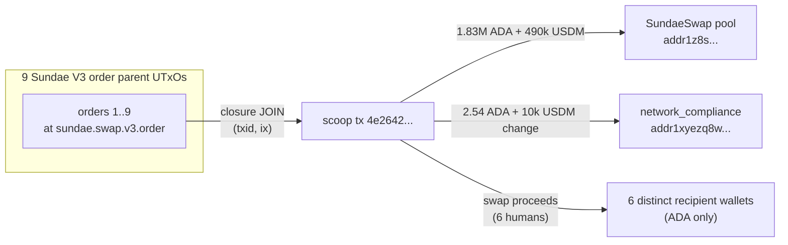

# Q10 — Scoop-recipient resolution (post-scoop, blueprint-free path)

The post-scoop path for finding the human recipient: follow a swap
order to its scoop and read the recipient outputs WITHOUT decoding
the swap-order datum. This is the pre-typed-datum approach.

The newer typed-datum path is in
[Q11 self-swap validation](q11-self-swap-validation.md), which reads
the recipient straight off `OrderDatum.destination` at placement time
(see [limitation #5 in the presentation](../case.md#5-sundae-v3-order-datum-typed-via-operator-override)
for the override that enables it). Q10 stays useful as the
post-settlement audit lens — the actual UTxO recipients are visible
on chain even without the typed decode.

The scoop transaction is pinned via `VALUES` to the 9-order dive
`4e2642…` from the May 2026 seed batch.
Per-recipient aggregation collapses the three ADA UTxOs that landed
at user 4 (`addr1q9v792a…`) and the two ADA UTxOs at user 6
(`addr1qy4xf86…`) into a single row each, while preserving the
UTxO count.

<div class="scrollbox" markdown>

```sparql
PREFIX cardano: <https://lambdasistemi.github.io/cardano-ledger-rdf/vocab/cardano#>
PREFIX rdf:     <http://www.w3.org/1999/02/22-rdf-syntax-ns#>

SELECT ?scoopTxId ?recipientBech32
       (SUM(?lov) AS ?recipientLovelace)
       (SUM(?usdm) AS ?recipientUsdm)
       (COUNT(DISTINCT ?recipientOut) AS ?utxoCount)
WHERE {
  VALUES ?scoopTxId { "4e2642080c8d171aad05baed11b076de498b76acecc1c2412660048fae8aefa3" }
  ?scoop a cardano:Transaction ;
         cardano:hasTxId/cardano:bytesHex ?scoopTxId ;
         cardano:hasOutput ?recipientOut .
  ?recipientOut cardano:atAddress ?recipientAddr ;
                cardano:lovelace ?lov .
  ?recipientAddr cardano:bech32 ?recipientBech32 .
  # Drop outputs that land back on the Sundae V3 order script itself
  FILTER NOT EXISTS {
    ?recipientAddr cardano:hasPaymentCredential/cardano:hasIdentifier ?rId .
    ?rId cardano:bytesHex
           "fa6a58bbe2d0ff05534431c8e2f0ef2cbdc1602a8456e4b13c8f3077" .
  }
  OPTIONAL {
    ?recipientOut cardano:hasAssetValue/rdf:rest*/rdf:first ?asset .
    ?asset cardano:hasIdentifier ?usdmId ; cardano:quantity ?usdm .
    ?usdmId cardano:bytesHex
              "c48cbb3d5e57ed56e276bc45f99ab39abe94e6cd7ac39fb402da47ad0014df105553444d" .
  }
}
GROUP BY ?scoopTxId ?recipientBech32
ORDER BY DESC(?recipientLovelace)
```

</div>

For the 9-order scoop dive `4e2642…`:

| recipient (truncated)                            | UTxOs | ADA              | USDM             |
|--------------------------------------------------|------:|-----------------:|-----------------:|
| `addr1z8srqftq...` (SundaeSwap pool / settlement) | 1     | 1,833,033.390929 | 490,819.149109   |
| `addr1q9v792a...` (human user 4)                 | 3     |     11,356.973350 |          0.000000 |
| `addr1q93k6rg...` (human user 1)                 | 1     |      5,374.667017 |          0.000000 |
| `addr1qyh6anc...` (human user 2)                 | 1     |      5,054.620800 |          0.000000 |
| `addr1q97zqkf...` (human user 3)                 | 1     |      4,081.058504 |          0.000000 |
| `addr1v998zy8...` (human user 5)                 | 1     |      3,150.983800 |          0.000000 |
| `addr1qy4xf86...` (human user 6)                 | 2     |      2,040.173222 |          0.000000 |
| `addr1xyezq8w...` (network_compliance change)     | 1     |          2.544001 |     10,056.677769 |

ADA values are derived from the raw lovelace returned by the query
(divide by 10⁶); USDM values are derived from the raw quantity
returned by the query (divide by 10⁶, USDM has 6 decimals). The
`addr1xyezq8w…` row matches the `network_compliance` bech32 from
`rules.yaml` — the USDM change from the scoop lands back on the
treasury scope.



The cross-tx JOIN answers *"where did the value go after the
scoop?"* directly from the closure — no datum decode required.
The 6 distinct human recipients are visible from address triples
alone.

---


Return to the [presentation](../case.md).
