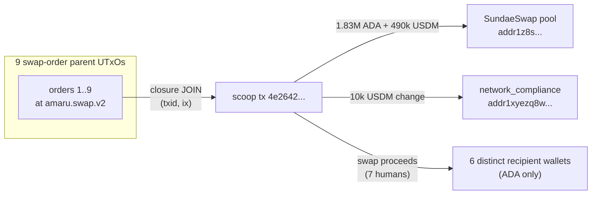

# Q10 — Scoop-recipient resolution (blueprint-free workaround)

This is the demo of the documented [tx-lattice limitation
workaround](#known-limitations) <!-- tx-lattice docs page removed; see #31 -->: follow a swap order
to its scoop to find the human recipient WITHOUT decoding the
swap-order datum.

```sparql
PREFIX cardano: <https://lambdasistemi.github.io/cardano-ledger-rdf/vocab/cardano#>
PREFIX rdf:     <http://www.w3.org/1999/02/22-rdf-syntax-ns#>

SELECT ?scoopTxId ?recipientBech32 ?recipientLovelace ?recipientUsdm
WHERE {
  # 1. Identify scoop seed txs (≥1 swap.v2 utxo consumed via closure)
  { SELECT DISTINCT ?scoopTxId WHERE {
      ?B cardano:hasLatticeRole "seed" ; cardano:hasTxId/cardano:bytesHex ?scoopTxId ;
         cardano:hasInput ?in .
      ?in cardano:fromTxOutRef ?ref .
      ?ref cardano:hasTxId ?h ; cardano:hasIndex ?ix .
      ?h cardano:bytesHex ?parentHex .
      ?A cardano:hasTxId/cardano:bytesHex ?parentHex ; cardano:hasOutput ?orderOut .
      ?orderOut cardano:hasIndex ?ix ;
                cardano:atAddress/cardano:hasPaymentCredential/cardano:hasIdentifier ?id .
      ?id cardano:bytesHex
            "fa6a58bbe2d0ff05534431c8e2f0ef2cbdc1602a8456e4b13c8f3077" .
  } }
  # 2. List the scoop's non-swap-script outputs as recipient candidates
  ?scoop cardano:hasTxId/cardano:bytesHex ?scoopTxId ; cardano:hasOutput ?recipientOut .
  ?recipientOut cardano:atAddress ?recipientAddr ;
                cardano:lovelace ?recipientLovelace .
  ?recipientAddr cardano:bech32 ?recipientBech32 .
  FILTER NOT EXISTS {
    ?recipientAddr cardano:hasPaymentCredential/cardano:hasIdentifier ?rId .
    ?rId cardano:bytesHex
           "fa6a58bbe2d0ff05534431c8e2f0ef2cbdc1602a8456e4b13c8f3077" .
  }
  OPTIONAL {
    ?recipientOut cardano:hasAssetValue/rdf:rest*/rdf:first ?asset .
    ?asset cardano:hasIdentifier ?usdmId ; cardano:quantity ?recipientUsdm .
    ?usdmId cardano:bytesHex
              "c48cbb3d5e57ed56e276bc45f99ab39abe94e6cd7ac39fb402da47ad0014df105553444d" .
  }
}
```

For the 9-order scoop dive `4e2642...`:

| recipient (truncated)                            | ADA            | USDM        |
|--------------------------------------------------|---------------:|------------:|
| `addr1z8srqftq...` (SundaeSwap pool / settlement) | 1,833,033.39   | 490,819.15  |
| `addr1xyezq8w...` (network_compliance change)     |         2.54   |  10,056.68  |
| `addr1q93k6rg...` (human user 1)                 |     5,374.67   |       0.00  |
| `addr1qyh6anc...` (human user 2)                 |     5,054.62   |       0.00  |
| `addr1q97zqkf...` (human user 3)                 |     4,081.06   |       0.00  |
| `addr1q9v792a...` (human user 4, 3 UTxOs)        |    11,357.0    |       0.00  |
| `addr1v998zy8...` (human user 5)                 |     3,150.98   |       0.00  |
| `addr1qy4xf86...` (human user 6, 2 UTxOs)        |     2,040.17   |       0.00  |



The cross-tx JOIN answers *"where did the value go after the
scoop?"* directly from the closure — no datum decode required.
The 6 distinct human recipients are visible from address triples
alone.

---


Return to the [presentation](../case.md).
