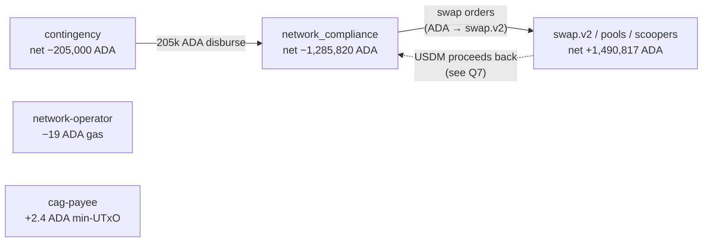

# Q3 — Per-scope ADA flow

```sparql
# Body of the query — full version uses VALUES + IF mapping; see
# queries/03-scope-flow.rq. The "other" bucket holds every bech32
# NOT in the four named scopes so conservation holds across the
# whole table.
SELECT ?scope (SUM(?lovIn) AS ?ada_in) (SUM(?lovOut) AS ?ada_out)
       ((SUM(?lovIn) - SUM(?lovOut)) AS ?net)
WHERE {
  { ?seed cardano:hasLatticeRole "seed" ; cardano:hasOutput ?out .
    ?out cardano:atAddress/cardano:bech32 ?bech ; cardano:lovelace ?lovIn .
    BIND (0 AS ?lovOut) }
  UNION
  { ?seed cardano:hasLatticeRole "seed" ; cardano:hasInput ?in .
    ?in cardano:fromTxOutRef ?ref .
    ?ref cardano:hasTxId ?h ; cardano:hasIndex ?ix .
    ?h cardano:bytesHex ?parentHex .
    ?parent cardano:hasTxId/cardano:bytesHex ?parentHex ; cardano:hasOutput ?parentOut .
    ?parentOut cardano:hasIndex ?ix ;
               cardano:atAddress/cardano:bech32 ?bech ;
               cardano:lovelace ?lovOut .
    BIND (0 AS ?lovIn) }
  BIND ( IF(?bech = "...", "amaru-treasury.contingency", ... "other") AS ?scope )
}
GROUP BY ?scope
```

| scope                                     | ADA in        | ADA out       | net           |
|-------------------------------------------|--------------:|--------------:|--------------:|
| amaru-treasury.network_compliance         | 14,923,951.46 | 16,209,772.18 | **−1,285,820.72** |
| amaru-treasury.contingency                |  3,852,000.00 |  4,057,000.00 |    **−205,000.00** |
| other (swap.v2 + pools + scoopers + …)    |  3,407,732.62 |  1,916,915.17 |    **+1,490,817.45** |
| amaru.network-operator                    |      2,391.52 |      2,410.55 |          −19.03 |
| amaru.cag-payee                           |          2.38 |          0.00 |          +2.38 |

Sum of `net` = −19.93 ADA = the total of Q1 fees (perfect conservation).
The 205k ADA disburse left contingency and landed at
network_compliance; another 1.29M ADA left network_compliance into
swap.v2 orders (recovered as USDM on the scoop side).



---


Return to the [presentation](../case.md).
