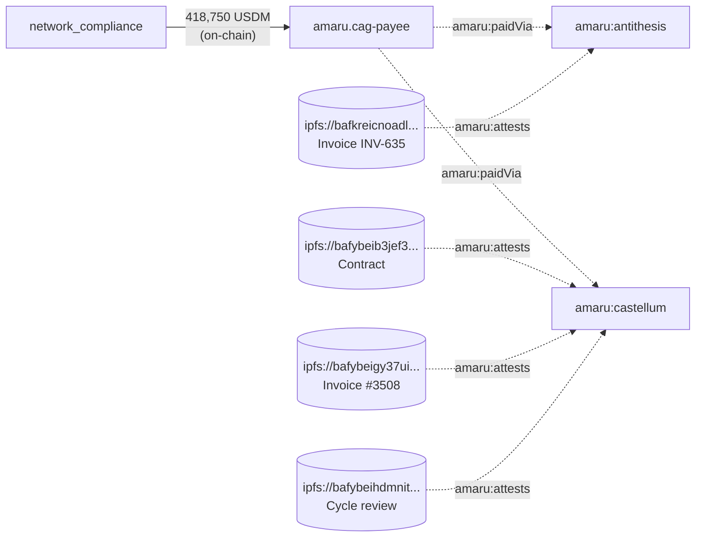

# Q5 — Vendor-payment chain (lattice × overlay)

```sparql
PREFIX cardano: <https://lambdasistemi.github.io/cardano-ledger-rdf/vocab/cardano#>
PREFIX amaru:   <https://amaru.tech/rdf/>
PREFIX rdfs:    <http://www.w3.org/2000/01/rdf-schema#>
PREFIX rdf:     <http://www.w3.org/1999/02/22-rdf-syntax-ns#>

SELECT ?vendor ?attestation ?ipfs ?usdmTotalAtBridge
WHERE {
  { SELECT (SUM(?qty) AS ?usdmTotalAtBridge) WHERE {
      ?seed cardano:hasLatticeRole "seed" ; cardano:hasOutput ?out .
      ?out cardano:atAddress/cardano:bech32
             "addr1q8qrds2nnx7clx3kcpp2l0eu45twmdcahsfu9m0xcwy59j6xz3vs0hnfaz9nhje8z34kfnds4jyk7hs6dnrag6e2lfgqtyf4rl" ;
           cardano:hasAssetValue/rdf:rest*/rdf:first ?asset .
      ?asset cardano:hasIdentifier ?id ; cardano:quantity ?qty .
      ?id cardano:bytesHex
            "c48cbb3d5e57ed56e276bc45f99ab39abe94e6cd7ac39fb402da47ad0014df105553444d" .
  } }
  ?vendor amaru:paidVia amaru:cag-payee .
  ?attestation amaru:attests ?vendor ; amaru:ipfs ?ipfs .
}
```

| vendor (overlay)          | IPFS attestation                                                                                  |
|---------------------------|---------------------------------------------------------------------------------------------------|
| `amaru:antithesis`        | `ipfs://bafkreicnoadlgnc6cqxggxboho7yt532lkonxcusj3ndsxdnv5szyswyam` — Invoice INV-635           |
| `amaru:castellum`         | `ipfs://bafybeib3jef34ndw6oe24mkmifdvxe5jrv7ulh63rdllovyth27mqfj2da` — Contract                  |
| `amaru:castellum`         | `ipfs://bafybeigy37ui2ikn7bim2vw6cojcbxkcndpjwh7cj5fv3vzs4cszezipxu` — Invoice #3508             |
| `amaru:castellum`         | `ipfs://bafybeihdmnitrbu2oir3r2fefnpqy3bk7zdz42olzmltmxyt5xag4i2t5a` — May2026 cycle review      |

USDM total at the bridge in May = **418,750.00 USDM**. The query joins
on-chain USDM movement (lattice) to off-chain accountability
(overlay) — vendors, contracts, invoices, cycle reviews — by
walking `amaru:paidVia` and `amaru:attests` across two graph
sources in one SPARQL invocation.



---


Return to the [presentation](../case.md).
