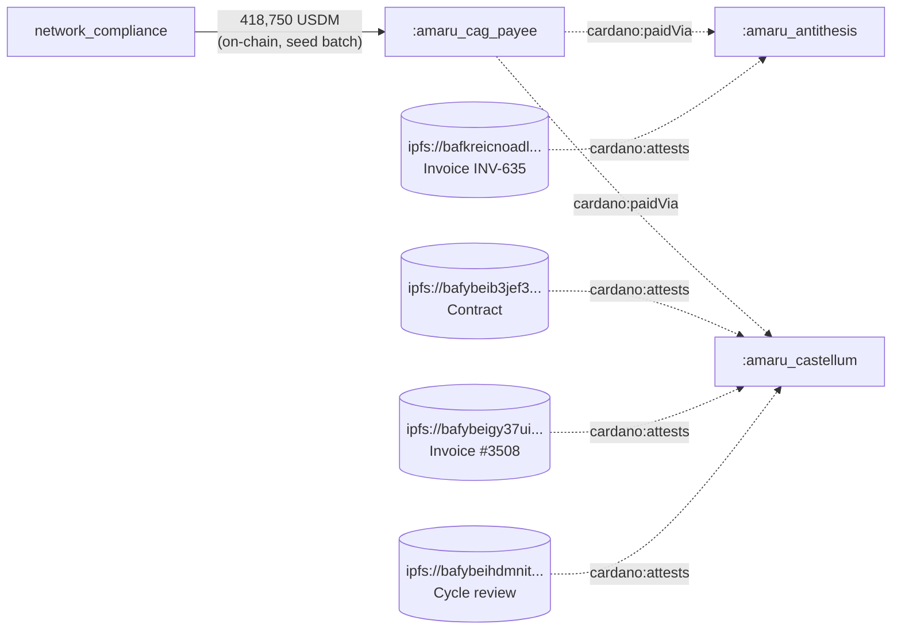

# Q5 — Vendor-payment chain (lattice × overlay)

The on-chain side (USDM at `amaru.cag-payee` in the seed batch) and
the off-chain side (vendors and attestations from `rules.yaml`) are
emitted into the same lattice file by `tx-graph --rules` — so a
single SPARQL invocation joins them.

<div class="scrollbox" markdown>

```sparql
PREFIX cardano: <https://lambdasistemi.github.io/cardano-ledger-rdf/vocab/cardano#>
PREFIX rdfs:    <http://www.w3.org/2000/01/rdf-schema#>
PREFIX rdf:     <http://www.w3.org/1999/02/22-rdf-syntax-ns#>
PREFIX :        <https://lambdasistemi.github.io/cardano-rdf/fixtures/tx#>

SELECT DISTINCT ?vendor ?attestationLabel ?ipfs ?usdmTotalAtBridge
WHERE {
  { SELECT (SUM(?qty) AS ?usdmTotalAtBridge) WHERE {
      VALUES ?seedTxId {
        "18d57a4f104df4cc776104ce626958e2110122392e4c4c7671edc8861b48452e"
        "affe90d1fa9a93b3e2a48009ef80634e9de8428640f5d673e85b002a86399982"
        "c150d5c5c67658c8f2a3bc24e16a4852257d46a03224257ac990fcca6f6fde78"
        "cb8f1a1254d650afc1c5b2a1e677df24ac72c4540e96eff52072bcb04b7274ba"
        "019586ee09f54155379d36ea2c6aa010296dcf5b8e28564a668bec1a44d8f503"
        "71ff129b5e0b5983ac01da968c6e345a8b6bc36d650a27f18c02ea9787a13dbe"
        "65bfd93936abf4fb26a135e89bd3ef133bb4b02152b37199586ed443979a95b1"
        "021e6b48610dd73b9c72c39f50986c1f2a34927fe7a764e0f06305f61b3b44ea"
        "013329ee0504d62c593491b76084bdd3958c0578037d28382c0de4611709c3f6"
        "107e439f247fad6bd05543d81b9139547c521f50e5409120bed9f3d80b644055"
        "10a5c1dafe7dd8d4ab680e35dc53b8b550da90bea55f2c758f36474064f2e598"
        "22e914892e83c22e19514937914ca32a0c059f9d1c5b555429edde0ea3406ae4"
        "2695f20941ac832a9b36fdbe4f0b78a8f5bafddf964b353b81aec360a13df3f3"
        "26ef34aa02aecfb068e44f00e7d2f50deef377d168a7e33d1e7d01a11f32d46d"
        "36d57c1be24bd617d1b7eb1f4aa4a391c3f351aa5b6cc4ac32ebc1dd2ded4d84"
        "488e5b417aa4f573528057fd1d7ab6de4f7ad06e296f945ee4097d8a94ee62e7"
        "5262be893119bd6d43c1c2fce5b0b89f7ac15f8e7d3d3dd66d0eb01e42b875d7"
        "59e10ca5e03b8d243c699fc45e1e18a2a825e2a09c5efa6954aec820a4d64dfe"
        "5fc04113da630ec676a5a7a66d82f53c0e64527ee592c3e6c5e1dccad67732ea"
        "7353059f0e0f59e974887b3f2405019e26c2a06673a9ce45d3cfdcbd814d5896"
        "7ac5f9e3f5de550b72aaf9e1c476bac02837e44d22600ddc00f63c7b4e753d7f"
        "a38cb99bab8eb9922454fc7ae61ca38ff31b54d0db4afa6b33933763ba1cfd09"
        "ad6ac0a1889733757f4503dac327ee57d3397dadf2948bff624f315ea0754aeb"
        "b5716ae98bb41b53c5fa2ebc6e8d5558879dc86d14fb998333e643095c6b233e"
        "b63aa2dd78c2a63b71aeba687cf45d445a98653a81f48774aa30236e47f30b86"
        "dfd355530e2d3baef6fc4cb22369c8b64aa117b0a84ff2cdaadc24cdc3fbc7bc"
        "f2791967f99ac04b33da17bd9c848b673c690a40d647b1e21e2651ff7a2f4657"
        "9f119393a85bb9aa0c94f8c649288dabb956b88dcbe055b10e741a2237123420"
        "a8bab7bfe1e2ed9d3a5b40189c8de51c5974a6e05c71fc1000a6abd57500b365"
        "4e2642080c8d171aad05baed11b076de498b76acecc1c2412660048fae8aefa3"
      }
      ?seed a cardano:Transaction ;
            cardano:hasTxId/cardano:bytesHex ?seedTxId ;
            cardano:hasOutput ?out .
      ?out cardano:atAddress/cardano:bech32
             "addr1q8qrds2nnx7clx3kcpp2l0eu45twmdcahsfu9m0xcwy59j6xz3vs0hnfaz9nhje8z34kfnds4jyk7hs6dnrag6e2lfgqtyf4rl" ;
           cardano:hasAssetValue/rdf:rest*/rdf:first ?asset .
      ?asset cardano:hasIdentifier ?id ; cardano:quantity ?qty .
      ?id cardano:bytesHex
            "c48cbb3d5e57ed56e276bc45f99ab39abe94e6cd7ac39fb402da47ad0014df105553444d" .
  } }
  ?vendorNode cardano:paidVia :amaru_cag_payee ; rdfs:label ?vendor .
  ?attestation cardano:attests ?vendorNode ;
               cardano:ipfs ?ipfs ;
               rdfs:label ?attestationLabel .
}
```

</div>

| vendor (overlay)    | attestation label      | IPFS                                                                 |
|---------------------|------------------------|----------------------------------------------------------------------|
| `amaru.antithesis`  | Invoice INV-635        | `ipfs://bafkreicnoadlgnc6cqxggxboho7yt532lkonxcusj3ndsxdnv5szyswyam` |
| `amaru.castellum`   | Contract               | `ipfs://bafybeib3jef34ndw6oe24mkmifdvxe5jrv7ulh63rdllovyth27mqfj2da` |
| `amaru.castellum`   | Invoice #3508          | `ipfs://bafybeigy37ui2ikn7bim2vw6cojcbxkcndpjwh7cj5fv3vzs4cszezipxu` |
| `amaru.castellum`   | May2026 cycle review   | `ipfs://bafybeihdmnitrbu2oir3r2fefnpqy3bk7zdz42olzmltmxyt5xag4i2t5a` |

USDM total at the bridge in May = **418,750.000000 USDM** (raw
quantity `418,750,000,000`). The query joins on-chain USDM movement
(seed batch outputs) to off-chain accountability (overlay) — vendors,
contracts, invoices, cycle reviews — by walking `cardano:paidVia`
and `cardano:attests` across the lattice in one SPARQL invocation.
The fixture-default `:` prefix
(`https://lambdasistemi.github.io/cardano-rdf/fixtures/tx#`) is the
IRI tx-graph emits for `rules.yaml`-declared overlay nodes when
`--rules` is passed on every per-tx emission (see pipeline.sh); the
vendor IRIs are `:amaru_antithesis` and `:amaru_castellum`. The
`SELECT DISTINCT` is needed because pipeline.sh re-emits the overlay
on every per-tx call, and the off-chain attestation/vendor blocks
appear as blank nodes whose identity does not dedup across emissions
— see limitation #9 below.



---


Return to the [presentation](../case.md).
