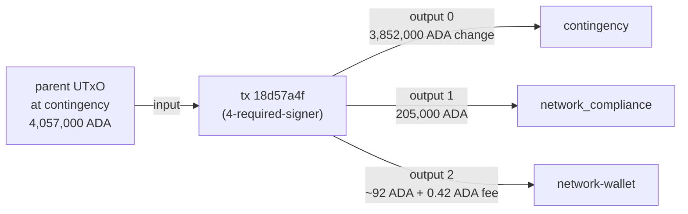

# Q6 — Disbursement detection

The contingency → network_compliance disbursement signature is "a
transaction that consumes a contingency UTxO and emits a
network_compliance output". This query expresses that pattern by
joining through the `cardano:Entity` overlay nodes that the
`rules.yaml` emit places in the lattice — so the bech32 addresses are
sourced from the overlay (`rdfs:label` lookup) rather than pasted as
literals.

<div class="scrollbox" markdown>

```sparql
PREFIX cardano: <https://lambdasistemi.github.io/cardano-ledger-rdf/vocab/cardano#>
PREFIX rdfs:    <http://www.w3.org/2000/01/rdf-schema#>

SELECT ?seedTxId ?lovelaceDisbursed
WHERE {
  ?cont a cardano:Entity ;
        rdfs:label "amaru-treasury.contingency" ;
        cardano:bech32 ?cAddr .
  ?nc   a cardano:Entity ;
        rdfs:label "amaru-treasury.network_compliance" ;
        cardano:bech32 ?ncAddr .
  ?seed a cardano:Transaction ;
        cardano:hasTxId/cardano:bytesHex ?seedTxId ;
        cardano:hasInput ?in ;
        cardano:hasOutput ?out .
  ?in cardano:fromTxOutRef ?ref .
  ?ref cardano:hasTxId ?h ; cardano:hasIndex ?ix .
  ?h cardano:bytesHex ?parentHex .
  ?parent cardano:hasTxId/cardano:bytesHex ?parentHex ; cardano:hasOutput ?parentOut .
  ?parentOut cardano:hasIndex ?ix ;
             cardano:atAddress/cardano:bech32 ?cAddr .
  ?out cardano:atAddress/cardano:bech32 ?ncAddr ;
       cardano:lovelace ?lovelaceDisbursed .
}
```

</div>

| tx hash                                                              | disbursed lovelace | disbursed ADA |
|----------------------------------------------------------------------|-------------------:|--------------:|
| `18d57a4f104df4cc776104ce626958e2110122392e4c4c7671edc8861b48452e`   | 205,000,000,000    | 205,000.000000 |

One disbursement in the lattice matches the pattern: 205,000 ADA from
contingency to network_compliance, in transaction `18d57a4f…`. The
query never needed a typed-redeemer decode — it pattern-matches on
the closure-resolved input address + the output address, with the
addresses themselves resolved through the entity overlay.



---


Return to the [presentation](../case.md).
