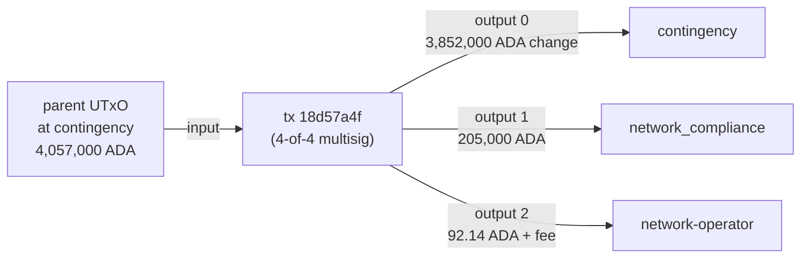

# Q6 — Disbursement detection

```sparql
PREFIX cardano: <https://lambdasistemi.github.io/cardano-ledger-rdf/vocab/cardano#>

SELECT ?seedTxId ?lovelaceDisbursed
WHERE {
  ?seed cardano:hasLatticeRole "seed" ;
        cardano:hasTxId/cardano:bytesHex ?seedTxId ;
        cardano:hasInput ?in ;
        cardano:hasOutput ?out .
  ?in cardano:fromTxOutRef ?ref .
  ?ref cardano:hasTxId ?h ; cardano:hasIndex ?ix .
  ?h cardano:bytesHex ?parentHex .
  ?parent cardano:hasTxId/cardano:bytesHex ?parentHex ; cardano:hasOutput ?parentOut .
  ?parentOut cardano:hasIndex ?ix ;
             cardano:atAddress/cardano:bech32 "addr1x8ndhlc...contingency" .
  ?out cardano:atAddress/cardano:bech32 "addr1xyezq8w...network_compliance" ;
       cardano:lovelace ?lovelaceDisbursed .
}
```

| tx hash                                                              | disbursed ADA |
|----------------------------------------------------------------------|--------------:|
| `18d57a4f104df4cc776104ce626958e2110122392e4c4c7671edc8861b48452e`   | 205,000.000   |

One disbursement in May: 205,000 ADA from contingency to
network_compliance. The query never needed a typed-redeemer decode —
it pattern-matches on the closure-resolved input address + the
output address.



---


Return to the [presentation](../case.md).
